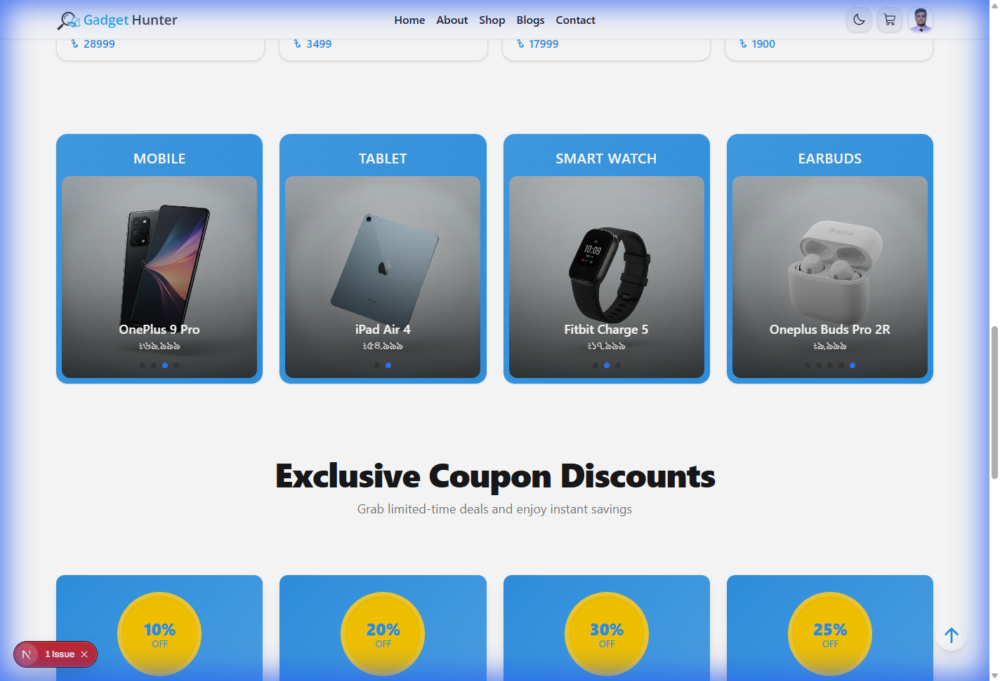
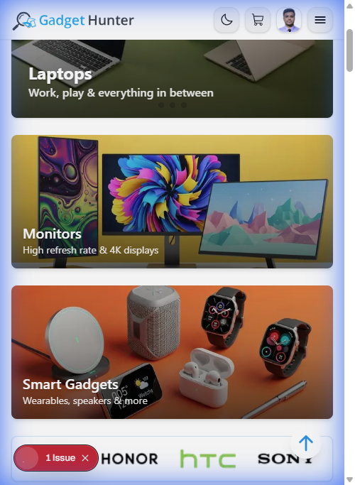
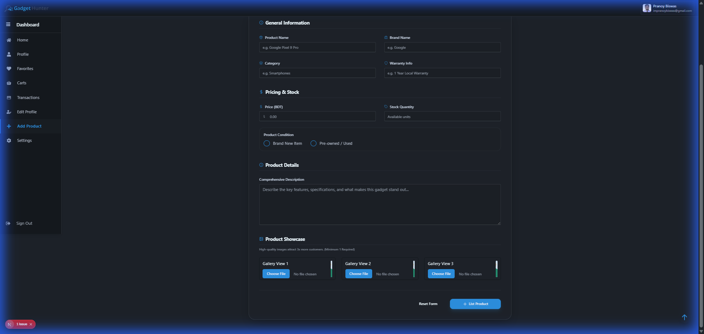
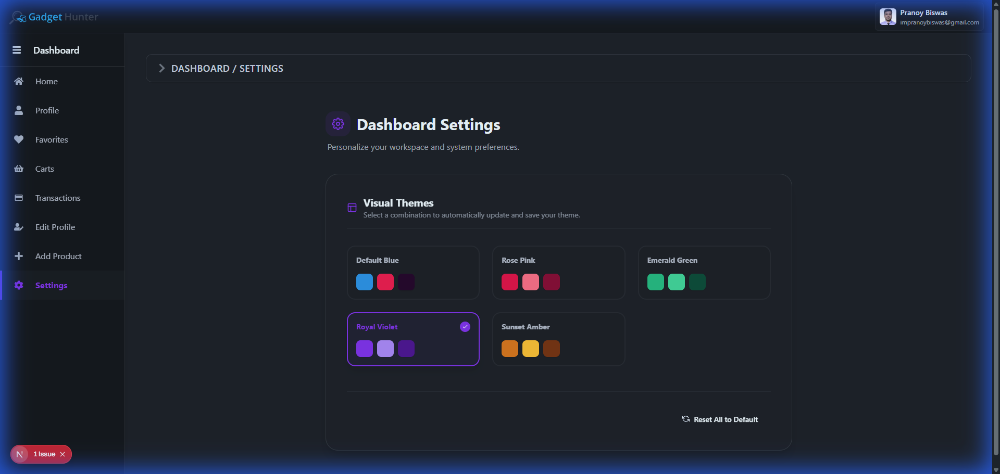

# Gadget Hunter — E-commerce Gadget Shop

> Modern, role-based gadget e-commerce storefront built with Next.js + TypeScript.  
> Live demo: [gadget-hunter-pranoy.vercel.app](https://gadget-hunter-pranoy.vercel.app/)

---

## 📸 Screenshots

### Desktop View


### Mobile View


### Seller Dashboard (Add Product & Settings)
| Add Product | Custom Settings |
| :--- | :--- |
|  |  |

---

## 🔑 Dummy Credentials
- **Admin Credentials**: `email: apurbo@gmail.com` | `password: Pass1234`

## 🚀 Features

### 👤 Role-Based Experience
- **Admin Dashboard**: Full administrative control over products, users, and order management.
- **Seller Portal**: Dedicated space for sellers to manage products, inventory, and track their sales metrics.
- **Customer Account**: Personal dashboard for order history, profile management, and persistent wishlists.

### 🛒 Core E-commerce Functionality
- **Advanced Search & Filtering**: Find products quickly with dynamic search and category-specific filters.
- **Persistent Cart & Wishlist**: Save items for later; cart contents persist across sessions.
- **Secure Checkout**: Streamlined multi-step checkout process with real-time validation.
- **Payment Integration**: Pluggable payment adapter system, currently featuring a robust sandbox simulator.
- **PDF Invoice Generation**: Automatically generate and download professional PDF invoices for every order.

### 🎨 Design & UX
- **Responsive UI**: Fully optimized for Desktop, Tablet, and Mobile devices using Tailwind CSS and DaisyUI.
- **Premium Aesthetics**: Smooth micro-animations powered by Framer Motion and modern typography.
- **Theme Toggling**: Instant light/dark mode switching for a comfortable viewing experience.
- **Smooth Scrolling**: Integrated with Lenis for a premium navigation feel.

### 🛠️ Technical Excellence
- **Next.js 15 (App Router)**: Utilizing the latest React features for optimal performance and SEO.
- **Efficient Data Handling**: Powered by TanStack Query for smart caching and background synchronization.
- **Secure Authentication**: Robust session management and role-based protection via NextAuth.js.
- **Scalable Database**: Leveraging MongoDB for flexible and robust data storage.

---

## 💻 Tech Stack

- **Framework**: [Next.js 15](https://nextjs.org/) (App Router)
- **Language**: [TypeScript](https://www.typescriptlang.org/)
- **Styling**: [Tailwind CSS](https://tailwindcss.com/) + [DaisyUI](https://daisyui.com/)
- **Animations**: [Framer Motion](https://www.framer.com/motion/) + [Lenis](https://lenis.darkroom.engineering/) (Smooth Scroll)
- **Database**: [MongoDB](https://www.mongodb.com/)
- **Authentication**: [NextAuth.js](https://next-auth.js.org/)
- **Data Fetching**: [TanStack Query](https://tanstack.com/query/latest)
- **Forms**: [React Hook Form](https://react-hook-form.com/)
- **Assets**: [ImageKit](https://imagekit.io/) (Image Optimization)
- **PDF Generation**: [jsPDF](https://rawgit.com/MrRio/jsPDF/master/docs/index.html) + [autoTable](https://github.com/simonbengtsson/jsPDF-autotable)

---

## 📁 Project Structure

```
/
├─ src/
│  ├─ app/           # App Router (Pages, Layouts, API)
│  ├─ components/    # Feature-specific components
│  ├─ ui/            # Reusable primitive UI components
│  ├─ providers/     # Context & State providers
│  ├─ lib/           # Utils, DB, Auth configurations
│  ├─ hooks/         # Custom React hooks
│  ├─ types/         # TypeScript definitions
│  └─ styles/        # Global CSS
├─ public/           # Static assets & screenshots
└─ .env.local        # Environment variables
```

---

## 🚀 Getting Started

1. **Clone the repository**:
   ```bash
   git clone https://github.com/impranoybiswas/gadget_hunter.git
   ```

2. **Install dependencies**:
   ```bash
   npm install
   ```

3. **Set up Environment Variables**:
   Create a `.env.local` file with:
   - `MONGODB_URI`
   - `NEXTAUTH_SECRET`
   - `IMAGEKIT_PUBLIC_KEY`
   - `IMAGEKIT_PRIVATE_KEY`
   - `IMAGEKIT_URL_ENDPOINT`

4. **Run the development server**:
   ```bash
   npm run dev
   ```

5. **Build for production**:
   ```bash
   npm run build
   ```

---

## 📧 Contact

**Pranoy** — Full Stack Web Developer  
Live Demo: [gadget-hunter-pranoy.vercel.app](https://gadget-hunter-pranoy.vercel.app/)  
GitHub: [@impranoybiswas](https://github.com/impranoybiswas)

